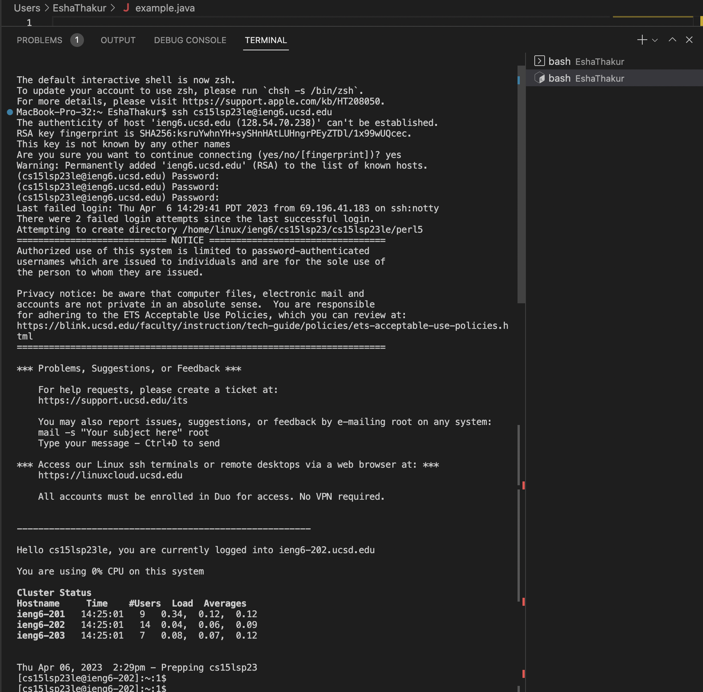
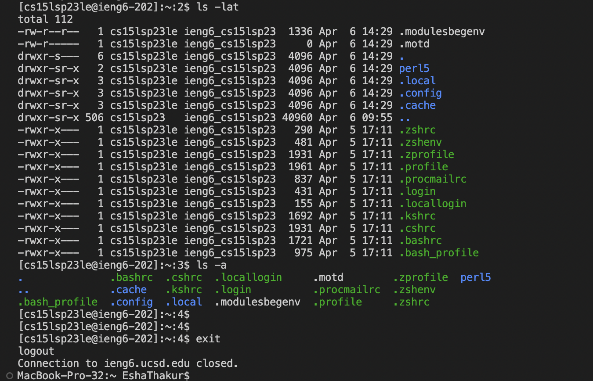

**Installing VScode:** I was fortunate and already had VScode downloaded because of a previous class. I remember I went to this url: [InstallVSCode](https://code.visualstudio.com/download)
Here is a screenshot of what the page should look like:
You should then be able to choose which directions you should need in order to download VScode.

**Remotely Connecting:** I have a mac which already comes with git downloaded. With a mac, you don't need to change the terminal to Bash, you should be able to work normally in the ```zsh``` terminal.

<br>Then, to view your course-specific CSE15L account use this link: [ViewAccount](https://sdacs.ucsd.edu/~icc/index.php) the page should look like this: 

For the username enter what comes before the '@' in your UCSD student email, for example my email is esthakur@ucsd.edu, my username is esthakur
<br> For the password enter in your student PID (it starts with an A). Here is a link to a step-by-step tutorial to reset your password, it includes images and directions that are very thorough: [PasswordReset](https://drive.google.com/file/d/17IDZn8Qq7Q0RkYMxdiIR0o6HJ3B5YqSW/view)
<br> You should set your password to something you will remember as you will have to enter it to log into the terminal.
<br>
<br> Next, to use ssh in VScode open the terminal and type in this command:
<br> ```ssh cs15lsp23zz@ieng6.ucsd.edu```  and press enter
<br> the 'zz' should be replaced by the 2 specific letters assigned to you
<br>
<br>Since this will be the first time you are connecting to this server you will be prompted with a message asking if you want to continue connecting (shown in the screenshot below), type yes then press enter.
<br>It will then prompt you for your password, type it in then press enter, notice that it won't show up on the screen when you type it. In the screenshot below I had 2 failed attempts and that is okay. But the screenshot shows what your terminal will look like the first time you log in.
<br> 
<br> Now your terminal is connected to a computer in the CSE basement, and any commands you run will run on that computer.


**Trying Some Commands:** here are some commands you can try out for fun, try and make note of what they do : 
1. ```cd ~``` : allows you to move in between dirctories, takes an argument after ~ (the folder you want to move to)
2. ```cd``` :  allows you to change in between directories, if no argument given it will change to the home directory
3. ```ls``` : prints out files of curent directory
4. ```ls -lat``` : lists all files or directories including the hidden files and directories, in a long list format, sorted by modification time
5. ```la -a``` : lists all files or directories including the hidden files and directories

<br> For example, I ran the ```ls -lat``` command and then the ```la -a``` and this is what it looked like for me: 
<br> 
<br> Those two commands both printed out all the current files including the hidden ones from the current directory. You can see that the ```ls -lat``` command sorted by modification time, where the time when I most recently worked on it is at the top. You can see that the ```ls -lat``` command also uses a long list format. You can also see that all the files listed under the ```la -a``` command are also listed under the ```ls -lat``` command.
<br> You can also see at the bottom, to log out of the remote server in your terminal you run the command exit 

