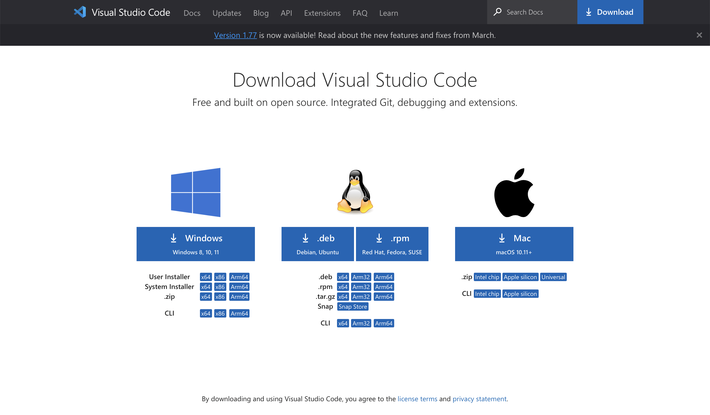

**Installing VScode:** I was fortunate and already had VScode downloaded because of a previous class. I remember I went to this url: [Link](https://code.visualstudio.com/download)
Here is a screenshot of what the page should look like:
You should then be able to choose which directions you should need in order to download VScode.

**Remotely Connecting** I have a mac which already comes with git downloaded. In order to use the Bash in VScode for mac:
   1.Open VScode and open the terminal
   2.Open the command pallete using command + shift + P
   3.Type "select defualt profile"
   4.Select Bash from the options (should be the first one to pop up)
   5.Click the + icon in the terminal window
The new terminal is now a Git Bash terminal, the right hand side of the terminal should look like this: 
   

Then, to view your course-specific CSE15L account use this link: [Link](https://sdacs.ucsd.edu/~icc/index.php) the page should look like this: 

For the username enter what comes before the '@' in your UCSD student email, for example my email is esthakur@ucsd.edu, my username is esthakur
  For the password enter in your student PID (it starts with an A). Here is a link to reset your password, it includes images and directions that are very thorough: [Link](https://drive.google.com/file/d/17IDZn8Qq7Q0RkYMxdiIR0o6HJ3B5YqSW/view)
  You should set your password to something you will remember as you will have to enter it to log into the terminal.
 
  Next, to use ssh in VScode open the terminal and type in this command: ssh cs15lsp23zz@ieng6.ucsd.edu  and press enter
  the 'zz' should be replaced by the 2 specific letters assigned to you
 
 Since this will be the first time you are connecting to this server you will be prompted with a message asking if you want to continue connecting (shown in the screenshot below), type yes then press enter.
 It will then prompt you for your password, type it in then press enter, notice that it won't show up on the screen when you type it. In the screenshot below I had 2 failed attempts and that is okay. But the screenshot shows what your terminal will look like the first time you log in.
  
  Now your terminal is connected to a computer in the CSE basement, and any commands you run will run on that computer.

**Trying Some Commands:** here are some commands you can try out for fun, try and make note of what they do : 

