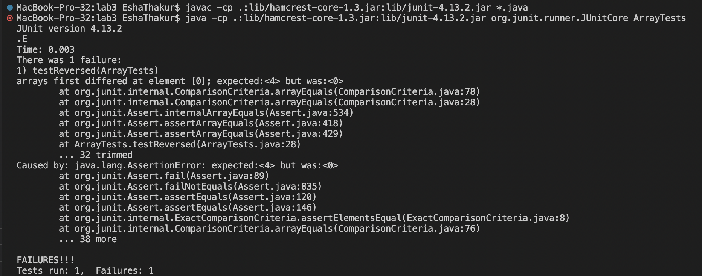
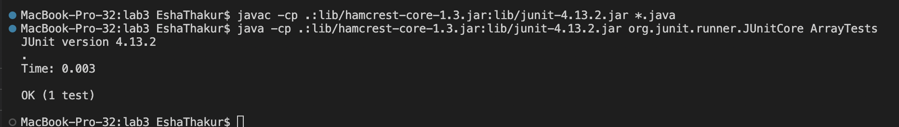

# Part 1
This is the code for my StringServer.java file :
```
import java.io.IOException;
import java.net.URI;
import java.util.ArrayList;
import java.util.zip.ZipOutputStream;

class Handler implements URLHandler {
    //ArrayList<String> words = new ArrayList<>();
    String words = "";
    
    public String handleRequest(URI url){
        
        if(url.getPath().equals("/")){
            return "Change path and query to /add-message?s=<string> to print out a string";
        }
        else if(url.getPath().equals("/add-message")){
            System.out.println("Path: " + url.getPath());
            System.out.println("URL: " + url);
            String[] parameters = url.getQuery().split("=");
            words += parameters[1] + "\n";
            return words;
        }
        else{ return "404 Not Found!";}
    }
}

class StringServer {
    public static void main(String[] args) throws IOException {
        if(args.length == 0){
            System.out.println("Missing port number! Try any number between 1024 to 49151");
            return;
        }

        int port = Integer.parseInt(args[0]);

        Server.start(port, new Handler());
    }
}
```


# Part 2
I chose the reversed method from lab3 as my bug for this report.
<br>
* Failure inducing input: 
 ```
 int[] input2 = {1,2,3,4};
 assertArrayEquals(new int[]{4,3,2,1}, ArrayExamples.reversed(input2));
```
* An input that doesn't induce a failure:
```
int[] input1 = { };
assertArrayEquals(new int[]{ }, ArrayExamples.reversed(input1));
```
* The Symptom as the output of running the tests:
<br> Test using input2 (failed test)
<br> 
<br> Test using input1 (passed test)
<br> 

* The bug:

<br> Code Before
```
static int[] reversed(int[] arr) {
    int[] newArray = new int[arr.length];

    for(int i = 0; i < arr.length; i += 1) {
      arr[i] = newArray[arr.length - i - 1];
    }
    return arr;
  }

```
<br> Code After
```
static int[] reversed(int[] arr) {
    int[] newArray = new int[arr.length];

    //create a deep copy of arr
    for(int i = 0; i < arr.length; i += 1) {
      newArray[i] = arr[i];
    }

    for(int i = 0; i < arr.length; i += 1) {
      arr[i] = newArray[arr.length - i - 1];
    }
    return arr;
  }
```
 <br> Needed to create a deep copy of arr. 
 <br>This fixes the issue because before implementing the deep copy, in the for loop, arr was getting assigned the incorrect values as newArray was initialized with the correct length but no values, each element was then getting stored with the default value of 0 for an empty array. 
 <br>That is why the error shows it was expecting the value for 4 but was getting 0.
 <br> Creating a deep copy of arr assigns all values of arr to newArray at the correct index, so you can then effectively reverse the elements of arr using newArray.
 
 # Part 3
 <br> Something I learned in lab from week 2 was how to use GitHub desktop to clone a repository. I have had experience with github in the past but without a proper tutorial it can become very confusing. Cloning is a very useful tool to track and record the changes made to a file. I found the tutorial to be very easy to follow. 
