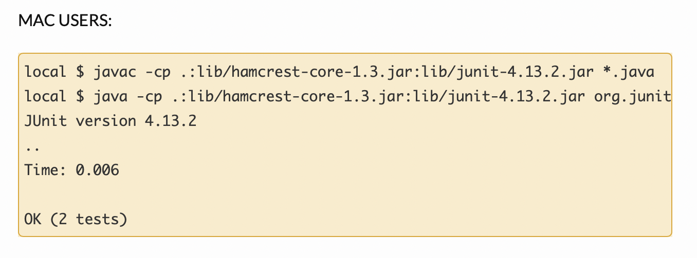
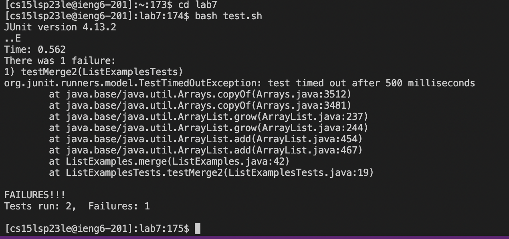

**Step 4: Log into ieng6**
 Keys pressed: `<up><enter>`
 `ssh cs15lsp23le@ieng6.ucsd.edu` command was up in my search history as I had just previously logged in to delete the existing lab7 directory.
 

 **Step 5: Clone your fork of the repository from your Github account**
 Keys pressed: `git<space>clone<space><command>v<enter>`
 I had the ssh clone url for lab7 copied to my clipboard and that is why I used `<command>v`
 
 
 **Step 6: Run the tests, demonstrating that they fail**
 Keys pressed: `cd<space>lab7<enter>` `<command>v<enter>` `<command>v<space>ListExamplesTests` 
 I had copied the `javac -cp .:lib/hamcrest-core-1.3.jar:lib/junit-4.13.2.jar *.java` `java -cp .:lib/hamcrest-core-1.3.jar:lib/junit-4.13.2.jar org.junit.runner.JUnitCore`commands from the week 3 page of the class website.
 
 

 **Step 7:Edit the code file `ListExamples.java` to fix the failing test**

 **Step 8:Run the tests, demonstrating that they now succeed**

 **Step 9:Commit and push the resulting change to your Github account**

