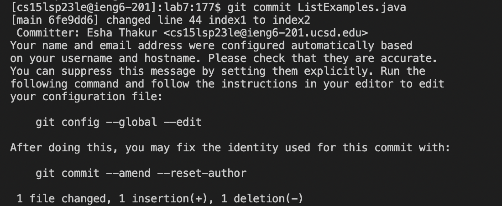
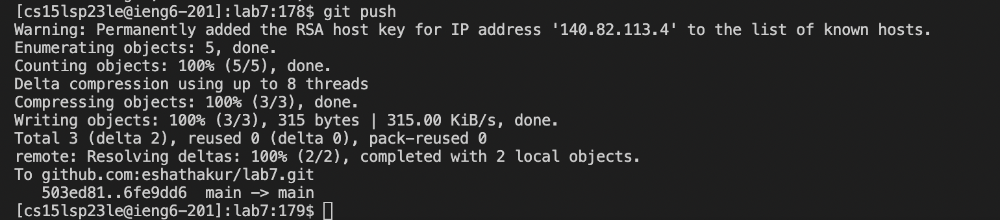
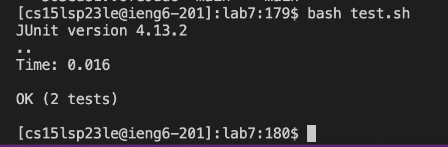

**Step 4: Log into ieng6**
 Keys pressed: `<up><enter>`
 `ssh cs15lsp23le@ieng6.ucsd.edu` command was up in my search history as I had just previously logged in to delete the existing lab7 directory.
 
 Summary: I logged into my ieng6 account, the up key was a shortcut so I didnt have to type it out and the enter key ran the command.

 **Step 5: Clone your fork of the repository from your Github account**
 Keys pressed: `git<space>clone<space><command>v<enter>`
 I had the ssh clone url for lab7 copied to my clipboard and that is why I used `<command>v`
 
 
 Summary: I cloned my fork of the lab7 repository using the ssh key because this allows for both cloning and pushing to the repository.

 **Step 6: Run the tests, demonstrating that they fail**
 Keys pressed: `cd<space>lab7<enter>` `bash<space>test.sh<enter>` 
 
 Summary: I changed the directory to lab7 then I ran the tests using the bash file test.sh to show that they fail.

 **Step 7:Edit the code file `ListExamples.java` to fix the failing test**
 Keys pressed: `vim<space>ListExamples.java<enter>` `/change<enter>jllxi2<escape>:wq<enter>`
 
 Keys pressed: `git<space>commit<space>ListExamples.java<enter>` then to exit and save the commit `:wq<enter>` 
 
 Keys pressed: `git<space>push<enter>`
 
  I searched for the word 'change' as there is a comment right above the index that needs to be changed that starts off with the word 'change' and then I used j to go down 1 line, then used l twice to go to the right 2 times, then when the cursor was hovering over the 1 on index1 I used x to delete the 1 and then used i to get into insert mode and then inserted 2 then pressed escape to get out of insert mode. I then did `:wq<enter>` which exits out of vim abd saves the changes made to the file. I changed the index1 to index2 on line 44 of ListExamples.java
 **Step 8:Run the tests, demonstrating that they now succeed**
 Keys pressed:`bash<space>test.sh<enter>` 
 
 **Step 9:Commit and push the resulting change to your Github account**

