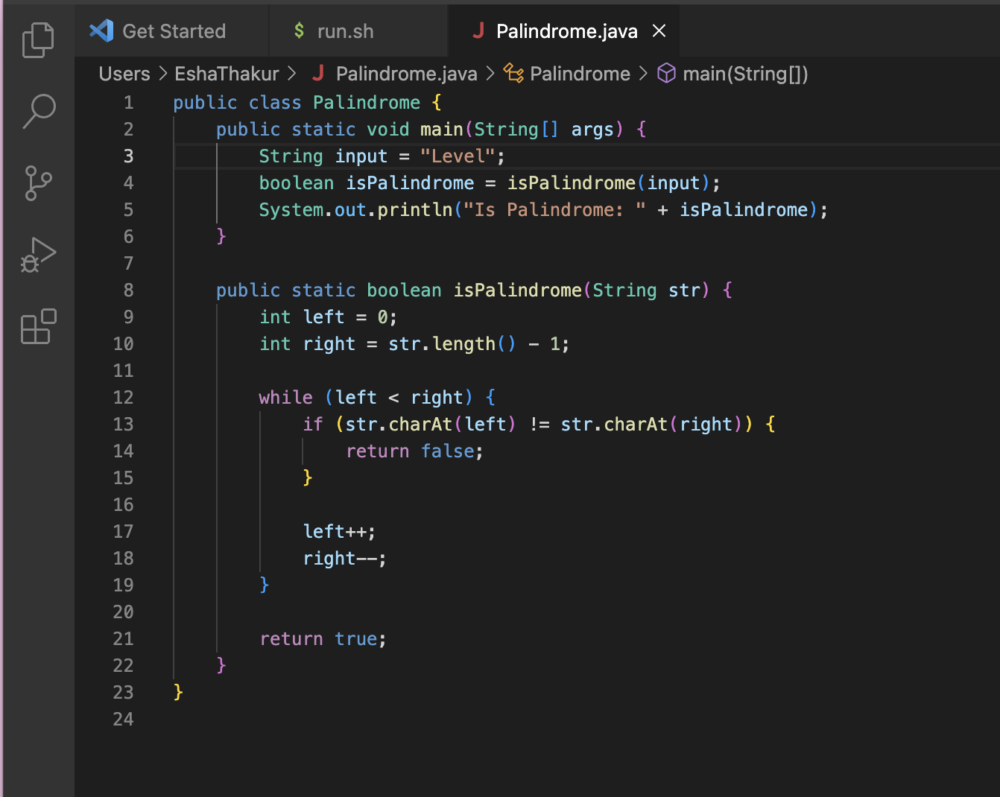
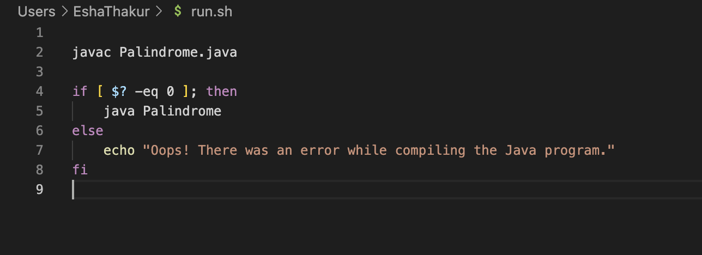
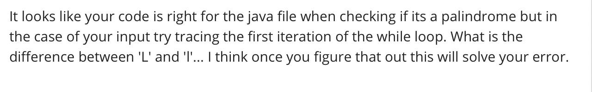
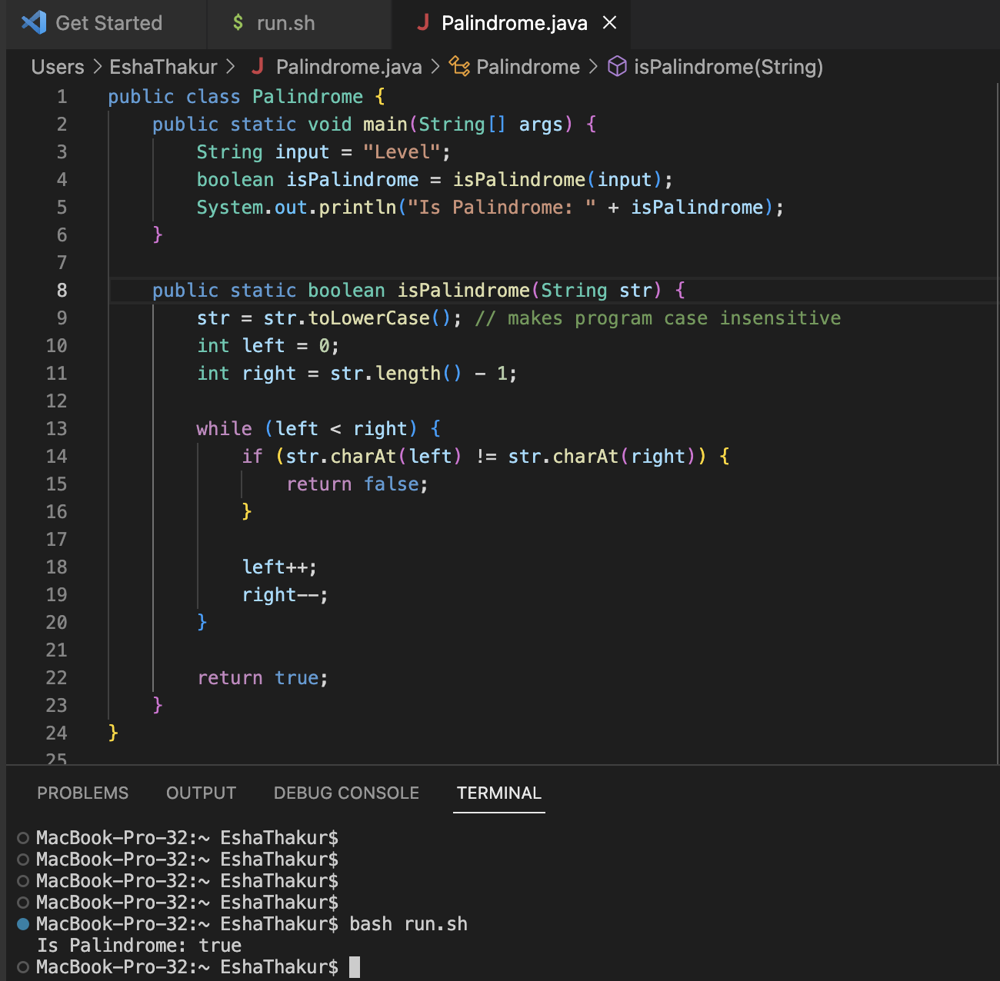

**Original post from student:**
 
 This is the screenshot of the java file: 
 This is the screenshot of the bash file: 
 **Response from TA:**
 
 **Fixing file:** 
 As the student, from this response I was able to see that the program was case sensitive and it did not see 'L' equal to 'l' 
 To fix this error, on line 9 I inserted a line of code that changed the input parameter (the string to check if its a palindrome) to all lowercase. This fixes the error and in the screenshot below the terminal produces the correct output. I did not need to make any changes to the bash file. The only command line I ran to test both files was `bash run.sh`
 
